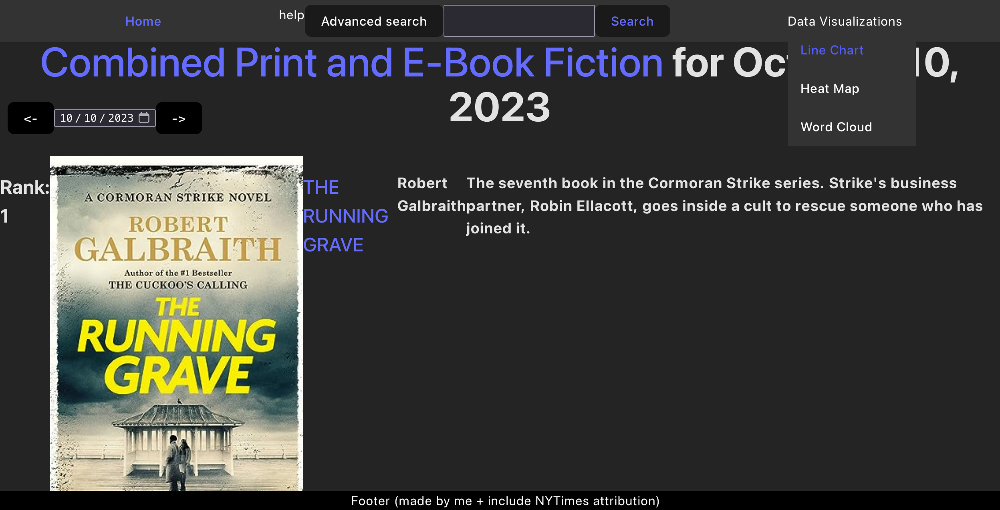
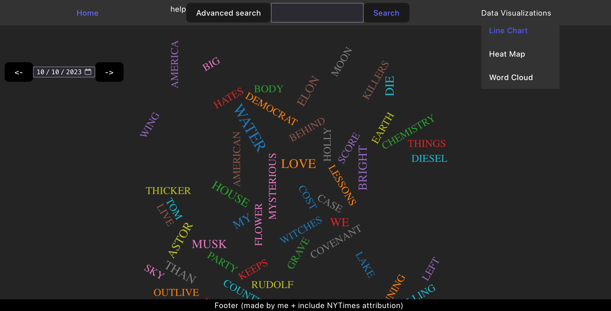
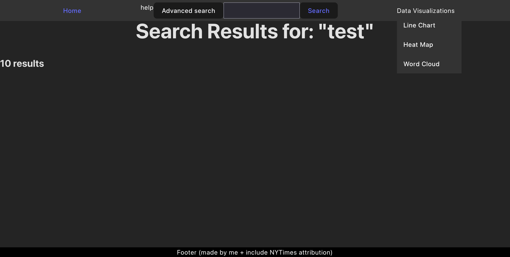

# Mod 2 Project

**Introduction**
A project to display NYTimes best sellers' information.

**Technologies Used**
* React
* NYTimes Book API

**Getting Started**
* Either visit this link: https://mod2.onrender.com/
* Or, clone the repo here https://github.com/czhu-24/perscholas-books-api-react-project and then start a development server for the react app (npm run dev).

**Unsolved Problems**
* Search via book title & author
* Discrepancy between date displayed in UI & date stored in the store
* More graceful throttling of API calls
* Caching of lists so site will make less API calls

**Future Enhancements**
* Adding functionality to line chart, heat map pages
* Better styling 
* Mobile responsiveness

